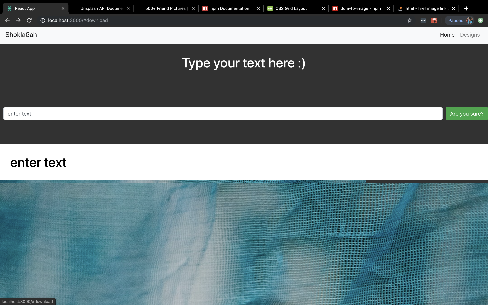
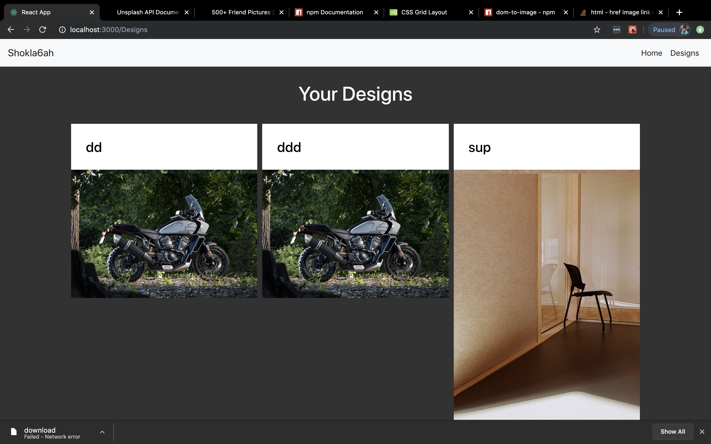
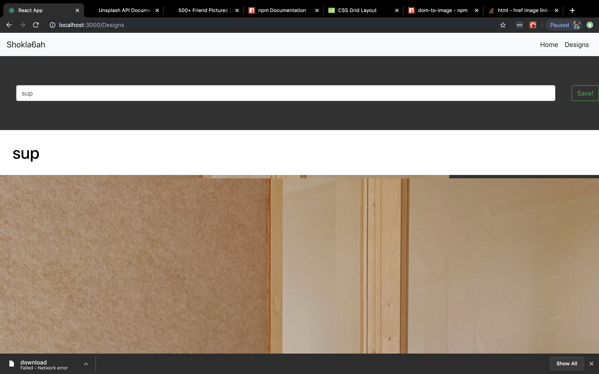

# Shokla6ah

A platform that gives comedy a second chance by giving comedians a good platform to make qualty memes.

## Description

Using react to make one page application that allows users to edit on photos giving them chance to make qualty content 

### Technical Used
What technologies you used that helped you build this project. 

```
Example:

- React
- Bootstrap with react
- Ajax (axios) for API
- React Router DOM
- DOM to Image
```

### Wireframes






### User Stories

As a user I can make qualty memes 
As a user I can choose an image
As a user I can put a title to an image 
As a user I can edit my designs
As a user I can have fun 
As a user I can challeng my frieds 

```
Example:

User must be able to:

- View Images
- Have fun 
- Create memes 
- Download memes
- Make content

```

---

## Planning and Development Process

I started with a simple sketch of the end product and after making the first prototype I redesigned the page with a great color scheme then I removed some bugs

### Problem-Solving Strategy

- print any result
- trail and error 
- trail and error 
- trail and error again and agian 


### Unsolved problems

None :) 

## APIs Used

- Unsplash

---

## Acknowledgments

- people are amazing
- I like helping others
- helping others delais me but its okay because I like it and I am up for the challenge 
- we have awsome instructors that gives you technical and emotional support
---

 ## References

- (https://unsplash.com/documentation#creating-a-developer-account)
- (https://docs.npmjs.com/
- (https://www.w3schools.com/css/css_grid.asp)
- (https://www.npmjs.com/package/dom-to-image)
- (https://stackoverflow.com/questions/2408146/href-image-link-download-on-click)